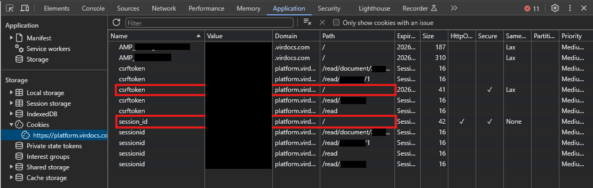

# RedShelf PDF Downloader

Automates the downloading of textbooks from RedShelf's Brytewave eReader in PDF format using `selenium`. Downloads as several PDFs then merges them all into a single PDF using `pypdf`.

## Setup

1. **Install dependencies**

   ```bash
   pip install selenium pypdf
   ```

2. **Edit the config**
    * Change the `textbook_id` variable to the ID of the textbook you want to download.
        - To obtain this, simply open up your textbook within the RedShelf eReader and grab the ID from the URL. 
        - The URL should look like `https://platform.virdocs.com/read/1234567/1/` where `1234567` is where your textbook ID should be located.
    * Replace the `value` fields in the `cookies` list with your actual session cookies values. This is for authenticating Selenium to be able to access the web pages.
        - To obtain these, go open up your textbook within the RedShelf eReader.
        - Then open your browser's developer tools (press F12), click on the "Application" tab, and click on the "Cookies" tab.
        - Copy the "Value" field of the cookie named `session_id` and paste it into your config. 
        - Copy the "Value" field of the cookie that is named `csrftoken` and has "Path" field of `/` and paste it into your config 
        
    * Change `file_prefix` to whatever you want, such as the name of the textbook. Changes the name of the PDFs created.
        - Example output if named "my_textbook": `my_textbook_0.pdf`
        - Also creates a folder of the same name within the same directory as `scrape.py` to store all of the PDFs.

4. **Run**
   After finishing configuring, simply run the script:
   ```bash
   python scrape.py
   ```

## Notes

- The script relies on Selenium to control Chrome in headless mode.
- The merged PDF is created using the pypdf library. If you don't want to have the PDFs be merged, the function call for this can be commented out in `__main__`
- Handshake failures/errors can be expected when running the script, these can be ignored.
- If failure occurs on page 0 (i.e. no PDFs are downloaded), ensure your textbook ID and cookies are correct.
- Output is stored within a folder that is created at runtime within the same directory that the script is ran in. 

## Disclaimer

This project is provided **for educational and personal-use purposes only**. Use of this tool may violate the terms of service of content providers and could be illegal under certain copyright laws in the U.S. or similar statutes in other jurisdictions. The authors **do not condone** the unauthorized reproduction, distribution, or circumvention of digital content protection measures. **You are solely responsible** for ensuring your use of this tool complies with all applicable laws and terms of service.  
